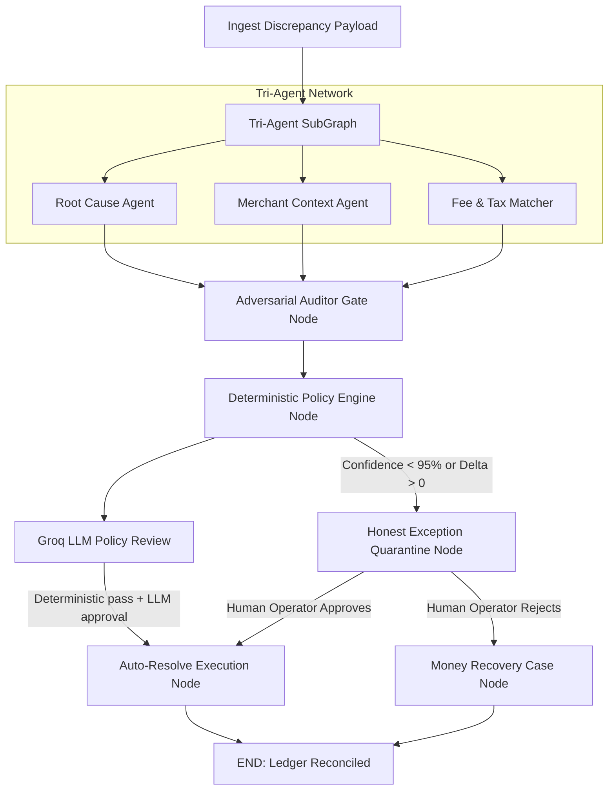

# 🟢 SettleWise — The Finance Controller That Tries to Prove Itself Wrong

> **Razorpay Buildathon 2026 Submission** | **Track 04: AI Finance Controller**  
> **Core Principle**: *"AI Proposes. AI Challenges. Rules Decide."*  
> **Control Loop**: `RECONCILE → INVESTIGATE → CHALLENGE → SIMULATE → AUTHORIZE → RECOVER`

---

## ⚡ Executive Summary

Most AI financial reconciliation systems ask a simple question: *"Can I reconcile this transaction?"*  
**SettleWise asks a much harder, CFO-grade question:**  
> *"Before I let AI touch the books, can I prove its reasoning is safe—and what happens to our capital if I tighten or loosen our policy controls?"*

Rather than being another basic "AI reconciliation bot" (a feature already built into standard dashboards), **SettleWise is a Counterfactual Financial Control System**. It operates on a 6-step autonomous loop:

```text
  [1. Reconcile] ──► [2. Investigate] ──► [3. Challenge (Adversarial Auditor)]
                                                      │
  [6. Recover]   ◄── [5. Authorize]   ◄── [4. Simulate (Policy Replay)]
```

---

## 🔥 The 3 Core USPs and Three design decisions that define SettleWise

### 1. 🤺 Adversarial Auditor: "The AI That Tries to Prove Itself Wrong"
* **The Innovation**: SettleWise does not simply pick the highest-confidence explanation. Before passing a hypothesis to authorization, an independent **Adversarial Auditor Agent** actively attempts to disprove the primary conclusion (testing counter-hypotheses like duplicate payout injection, T+1 settlement timing drift, or un-webhooked refunds).
* **The Safety Guarantee**: If counter-evidence cannot be disproven, auto-resolution is immediately blocked, eliminating false-positive payout risks.

### 2. 🎛️ Counterfactual Policy Simulator: "Simulate Policy Before Deployment"
* **The Innovation**: SettleWise gives Finance Controllers a live policy sandbox to answer: *"How much autonomy should the AI be allowed to have?"*
* **Quantified Exposure Modeling**: Controllers can adjust confidence thresholds (e.g. 95% vs 90% vs 99%) and margin caps across 10,000 records to instantly measure the trade-off: **Automation % vs. Potential Rupee Exposure/Leakage** before deploying policy changes to production.

### 3. 💸 Money Recovery Engine: "Finds Money That Books Lost"
* **The Innovation**: Standard reconciliation tools stop at flagging a mismatch. SettleWise isolates **why** money leaked (intermediate bank charge drops, MDR slab mismatches, missing webhook drops) and automatically generates **Dispute Claim File Bundles** complete with UTRs, timestamps, and contract rate proof for bank recovery.

---


## 🏗️ LangGraph State Machine Architecture (`@langchain/langgraph`)

SettleWise uses a formal **Stateful Multi-Agent Graph (`StateGraph`)** to govern financial exception lifecycles. The graph is executed both for an opened transaction and during Batch Runs:



### Graph Execution Nodes:
1. **`ingestionNode`**: Ingests multi-source ledger payloads & normalizes UTR vectors.
2. **`triAgentNode`**: Executes parallel diagnostic sub-agents (Root Cause, Merchant Context Memory, Fee/Tax Matcher).
3. **`auditorGateNode`**: Runs an independent Adversarial Auditor agent to test counter-hypotheses (duplicate payout injection, timestamp drift).
4. **`deterministicPolicyNode`**: Evaluates non-negotiable policy guardrails (confidence caps & margin tolerances).
5. **`llmPolicyReviewNode`**: Uses the server-side Groq endpoint as a second policy reviewer. Groq may veto an approval, but cannot override deterministic policy failure.
6. **`executeResolutionNode` / `blockExceptionNode`**: Auto-resolves verified payouts or pauses state at the exception quarantine for Human-in-the-Loop authorization.

---

## 🏗️ End-to-End System Architecture

```text
               ┌─────────────────────────────────────────┐
               │ Multi-Source Financial Ingestion Batch  │
               │ (Bank UTRs, Gateway Webhooks, ERP Logs) │
               └────────────────────┬────────────────────┘
                                    │
                                    ▼
               ┌─────────────────────────────────────────┐
               │    Deterministic Ledger Hash Matcher    │
               └──────────┬───────────────────┬──────────┘
                          │                   │
                Exact Match                 Discrepancy
                          │                   │
                          ▼                   ▼
                 [Auto-Close Books] ┌────────────────────────┐
                                    │ Tri-Agent Pipeline     │
                                    │ ├─ Root Cause Agent    │
                                    │ ├─ Merchant Context    │
                                    │ └─ Fee & Tax Matcher   │
                                    └─────────┬──────────────┘
                                              │
                                              ▼
                                    ┌────────────────────────┐
                                    │ Dual-Key Adversarial   │
                                    │ Auditor Gate           │
                                    └─────────┬──────────────┘
                                              │
                                              ▼
                                    ┌────────────────────────┐
                                    │ Deterministic Policy   │
                                    │ Authorization Engine   │
                                    └─────────┬──────────────┘
                                              │
                       ┌──────────────────────┴──────────────────────┐
                       ▼                                             ▼
            [PASS: Auto-Resolution]                       [FAIL: Honest Exception]
            ├── Write Settlement Ledger                   ├── Log Failure Reason
            └── Execute Recovery Case                     └── Route to Human Review
```

---

## 🔥 Key Technical Innovations

### 1. Tri-Agent Autonomous Decomposition Network
SettleWise splits complex financial investigation across three specialized AI sub-agents:
* **Agent 01 — Root Cause & Drift Agent**: Isolates numerical deltas between expected net payouts and actual bank credits.
* **Agent 02 — Merchant Context Vector Agent**: Queries vector memory for historical resolution patterns across merchant transaction profiles.
* **Agent 03 — Fee & Tax Matcher Agent**: Validates contractual MDR rates (e.g., 1.0% Enterprise Slab) and 18% GST tax invoice alignment.

### 2. Dual-Key Adversarial Auditor Gate
Before any hypothesis is sent for execution, an **Adversarial Auditor Agent** executes counter-evidence challenges. It tests for timing shifts (T+1 bank holiday roll), dropped webhooks, and duplicate batch injections to prevent false auto-resolutions.

### 3. Deterministic Policy Authorization Engine
Money movement is governed by non-negotiable mathematical guardrails:
* **AI Confidence Threshold**: Minimum 95.0% confidence required for auto-resolution.
* **Candidate Margin Delta**: Top hypothesis must outscore runner-up by $\ge 15.0\%$.
* **Arithmetic Ledger Verification**: Hard check ensuring $\text{Payment} - \text{Refund} - \text{MDR} = \text{Net Settlement}$.
* **Transaction Amount Cap**: Configurable auto-resolution ceiling (default ₹1,00,000).

### 4. Counterfactual Policy Replay & Benchmark Engine
Allows financial controllers and hackathon evaluators to test policy adjustments (e.g., tightening confidence thresholds) over **50 to 10,000 record synthetic batches** and view live impact on precision, recall, and honest exception counts.

### 5. Money Leakage & Recovery Controller
Automatically detects intermediate bank fee deductions and un-webhooked refunds, generating formal **Claim Dispute Packages** for financial ops teams.

## 📊 Evaluation Contract

Every replay uses a fixed seed (`SW-TRACK04-001`) and explicit synthetic ground-truth actions. The benchmark reports:

* Records processed and total rupees investigated
* Correct policy actions against ground truth
* Auto-resolution precision and false-positive rate
* Safe escalation coverage and the complete exception list
* Graph nodes executed, replay seed, and average pipeline latency

Batch Runs execute the same LangGraph StateGraph used when an operator opens a transaction. The benchmark runs ingestion, tri-agent analysis, adversarial audit, deterministic policy evaluation, optional Groq policy review, and terminal routing before scoring the exact processed batch. Langfuse receives live per-record traces for the first 100 records and the UI reports attempted, delivered, and failed trace counts.

## 🔐 AI and Observability Configuration

Copy `.env.example` to `.env` for local configuration. `GROQ_API_KEY` is used only by the server-side SettleWise Agent endpoint for optional reasoning enrichment. `LANGFUSE_PUBLIC_KEY`, `LANGFUSE_SECRET_KEY`, and `LANGFUSE_BASE_URL` enable trace ingestion. Configure secrets in Vercel Project Settings and never use the `VITE_` prefix for credentials.

Groq also runs as an optional `llmPolicyReviewNode` inside the LangGraph flow. Its verdict is merged with deterministic policy using a safety gate: deterministic failure always blocks auto-resolution, and an available LLM veto also blocks it. If Groq is unavailable, the graph records deterministic-only fallback and continues using the rules engine. Vercel serverless functions under `api/` keep Groq and Langfuse credentials out of the browser bundle.

---

## 🚀 Quickstart & Local Development

### Prerequisites
* Node.js v18+ 
* npm v9+

### Installation & Running Locally

1. **Install Dependencies**:
   ```bash
   npm install
   ```

2. **Launch Local Development Server**:
   ```bash
   npm run dev
   ```
   Open your browser at `http://localhost:5173`.

3. **Validate Production Build**:
   ```bash
   npm run build
   ```

---

## 🛠️ Technology Stack

* **Frontend**: React 18, TypeScript, Vite
* **Styling**: TailwindCSS, Lucide Icons, Glassmorphic Utility Design System
* **Engine**: Synthetic Financial Data Generator, Deterministic Policy Evaluator, Counterfactual Replay Suite

---

## 📜 License & Hackathon Attribution

Submitted for **Razorpay Buildathon 2026 — Track 04 (AI Finance Controller)**. Built with high precision, zero placeholders, and strict verification safety.
